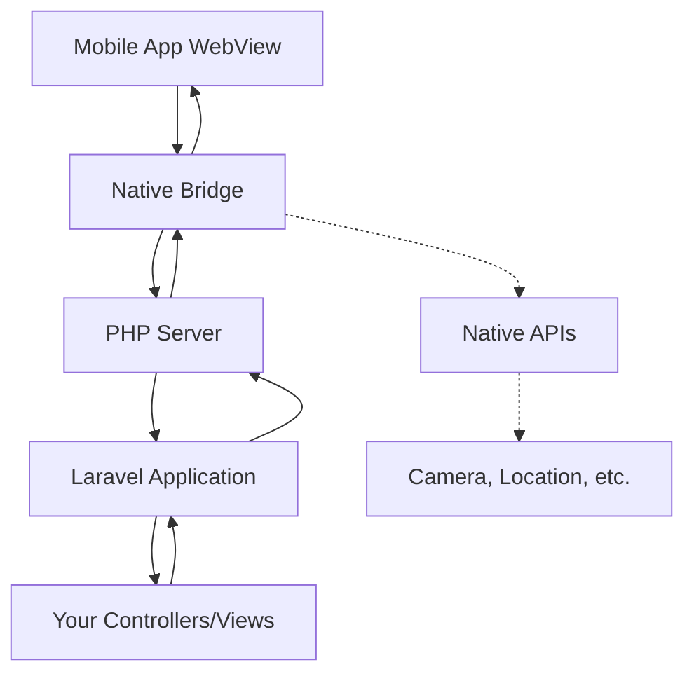

NativePHP Mobile enables you to run your Laravel application inside a native mobile app. This page explains the core architecture and how the different components work together.

## Overview

NativePHP Mobile uses a unique architecture that embeds a PHP server directly inside your mobile application. This allows your Laravel app to run natively on mobile devices without requiring external hosting.



## Core Components

### 1. Native Shell App

The mobile app container built with:
- **iOS**: Swift + WebKit (WKWebView)
- **Android**: Kotlin + WebView

The shell app provides:
- WebView for rendering your Laravel UI
- Native API access (camera, location, biometrics, etc.)
- PHP runtime environment
- HTTP server for Laravel

### 2. Embedded PHP Server

NativePHP Mobile bundles a complete PHP runtime inside the app. The server handles requests differently on each platform:

#### Android Request Flow

On Android, requests are processed through a custom bridge located at `bootstrap/android/native.php:1-121`:

<CodeGroup>
```php bootstrap/android/native.php
// Normalize incoming environment
if (isset($_SERVER['HTTP_COOKIE'])) {
    $cookiePairs = explode('; ', $_SERVER['HTTP_COOKIE']);
    $cookies = [];
    foreach ($cookiePairs as $pair) {
        $parts = explode('=', $pair, 2);
        if (count($parts) === 2) {
            $cookies[$parts[0]] = urldecode($parts[1]);
        }
    }
    $_COOKIE = $cookies;
}

// Preserve query params for ALL request methods
if (isset($_SERVER['QUERY_STRING']) && $_SERVER['QUERY_STRING'] !== '') {
    parse_str($_SERVER['QUERY_STRING'], $_GET);
}

// Handle Laravel request
$kernel = $app->make(Kernel::class);
$request = Request::capture();
$kernel->bootstrap();
$response = $kernel->handle($request);
$kernel->terminate($request, $response);
```
</CodeGroup>

The bootstrap script:
1. Normalizes cookies and query parameters
2. Captures the HTTP request
3. Bootstraps the Laravel kernel
4. Handles the request through your application
5. Returns the response with performance timing headers

<Info>
The embedded server includes performance monitoring that logs timing breakdowns for autoload, bootstrap, kernel initialization, and request handling.
</Info>

### 3. Native Bridge

The bridge connects PHP to native functionality through the `nativephp_call()` function:

```php
// From your Laravel code, call native APIs
if (function_exists('nativephp_call')) {
    nativephp_call('Camera.TakePhoto', json_encode(['options' => [...]])); 
}
```

When native code needs to notify Laravel (e.g., photo captured, QR code scanned), it dispatches Laravel events that you can listen to.

### 4. Laravel Integration Layer

The `NativeServiceProvider` registers all NativePHP components:

<CodeGroup>
```php NativeServiceProvider.php (excerpt)
public function packageBooted()
{
    $this->setupComposerPostUpdateScript();
    $this->registerNativeComponents();
    $this->registerMiddleware();
    $this->registerFilesystems();
    $this->registerBladeDirectives();
    
    $blade = app('blade.compiler');
    $blade->precompiler(new NativeTagPrecompiler($blade));
}
```
</CodeGroup>

Key registrations include:

**Blade Directives** (NativeServiceProvider.php:138-155):
```php
Blade::if('mobile', function () {
    return Facades\System::isMobile();
});

Blade::if('ios', function () {
    return Facades\System::isIos();
});

Blade::if('android', function () {
    return Facades\System::isAndroid();
});
```

**Middleware** (NativeServiceProvider.php:157-161):
Registers `RenderEdgeComponents` middleware that sends native UI component data after each request.

**Filesystems** (NativeServiceProvider.php:163-193):
Registers mobile-specific disks like `mobile_public` and `temp` for file operations.

## Request Lifecycle

Here's what happens when a user navigates in your app:

1. **User Interaction**: User taps a link or button in the WebView
2. **HTTP Request**: WebView sends request to embedded PHP server (typically `http://localhost:PORT`)
3. **Bootstrap**: PHP bootstrap script (platform-specific) receives the request
4. **Laravel Handling**: Request flows through Laravel's routing and middleware
5. **Response Generation**: Your controller/view generates HTML response
6. **Edge Components**: `RenderEdgeComponents` middleware sends native UI data
7. **Response Delivery**: HTML is returned to WebView
8. **Native UI Update**: Native components (like navigation bars) update if Edge components were used
9. **Rendering**: WebView displays the updated page

<Note>
The entire request is handled locally on the device - no internet connection required unless your app explicitly makes external API calls.
</Note>

## Platform Detection

Your Laravel app can detect which platform it's running on:

```php
use Native\Mobile\Facades\System;

if (System::isMobile()) {
    // Running in NativePHP Mobile app
}

if (System::isIos()) {
    // Running on iOS
}

if (System::isAndroid()) {
    // Running on Android  
}
```

This allows you to:
- Serve different layouts for mobile vs web
- Enable platform-specific features
- Adjust UI for iOS vs Android conventions

## File Storage

NativePHP Mobile configures special filesystem disks:

### `mobile_public` Disk

Mapped to `storage/app/public` with URL access through `/_assets/storage`:

```php
Storage::disk('mobile_public')->put('avatar.jpg', $image);
// Accessible at: /_assets/storage/avatar.jpg
```

### `temp` Disk

Provides access to the device's temporary directory:

```php
Storage::disk('temp')->put('cache.json', $data);
```

## Hot Reload Development

During development, NativePHP Mobile supports hot reload:

1. **File Watcher**: Monitors configured paths for changes
2. **WebSocket Server**: Maintains connection to mobile app
3. **Change Detection**: Detects file modifications
4. **Reload Trigger**: Sends reload command via WebSocket
5. **App Refresh**: Mobile app reloads the WebView

Configuration is in `config/nativephp.php`:

```php
'hot_reload' => [
    'watch_paths' => [
        'app',
        'resources',
        'routes',
        'config',
        'public',
    ],
    'exclude_patterns' => [
        '\.git',
        'storage',
        'tests',
        'nativephp',
    ],
],
```

## Vite Integration

NativePHP Mobile configures platform-specific Vite hot files (NativeServiceProvider.php:230-244):

```php
$hotFile = match (config('nativephp-internal.platform')) {
    'ios' => public_path('ios-hot'),
    'android' => public_path('android-hot'),
    default => public_path('hot'),
};

Vite::useHotFile($hotFile);
```

This allows running iOS and Android development servers simultaneously on different ports.

## Performance Considerations

<Warning>
**OPcache is critical**: The embedded PHP server includes OPcache monitoring. Make sure OPcache is enabled for production builds to achieve optimal performance.
</Warning>

The bootstrap script logs detailed performance metrics:

```
PerfTiming: PHP opcache=enabled,cached=150 autoload=5.2ms 
bootstrap=12.3ms kernel=1.1ms capture=0.3ms 
kernel_boot=45.2ms handle=38.7ms total=102.8ms
```

Optimization tips:
- Keep route files lean
- Use route caching for production
- Minimize service provider boot logic
- Cache configuration and views
- Enable OPcache in production builds

## Next Steps

<CardGroup cols={2}>
  <Card title="App Lifecycle" icon="arrows-rotate" href="/concepts/lifecycle">
    Learn about app lifecycle events and how to respond to them
  </Card>
  <Card title="Configuration" icon="gear" href="/concepts/configuration">
    Explore all configuration options
  </Card>
  <Card title="Blade Components" icon="code" href="/concepts/blade-components">
    Discover native UI components
  </Card>
  <Card title="Building Your App" icon="hammer" href="/build/packaging">
    Learn how to build production apps
  </Card>
</CardGroup>