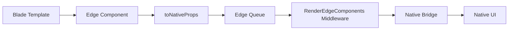

NativePHP Mobile provides Blade components that render as native UI elements on mobile devices. These components give your app a truly native feel with platform-specific navigation, buttons, and other UI elements.

## Overview

Native Blade components are registered automatically by the `NativeServiceProvider` (NativeServiceProvider.php:330-372). They extend the `EdgeComponent` base class and communicate with native code through the Edge system.

### How It Works

1. **Component Registration**: Components are auto-discovered from `src/Edge/Components/` and registered with Blade
2. **Rendering**: When rendered, components are converted to native props and queued
3. **Middleware**: The `RenderEdgeComponents` middleware sends queued components to native code after each request
4. **Native Rendering**: The mobile app renders native UI elements based on the component data



## Platform Detection Directives

Use these Blade directives to conditionally render content based on the platform:

### @mobile / @web

Show different content for mobile vs web:

```blade
@mobile
    <x-native-top-bar title="Dashboard" />
    <div class="mobile-layout">
        <!-- Mobile-optimized content -->
    </div>
@endmobile

@web
    <nav class="desktop-nav">
        <!-- Desktop navigation -->
    </nav>
@endweb
```

### @ios / @android

Platform-specific rendering:

```blade
@ios
    <!-- iOS-specific UI -->
    <div class="ios-style-header">Welcome</div>
@endios

@android
    <!-- Android-specific UI -->
    <div class="material-header">Welcome</div>
@endandroid
```

<Tip>
Use these directives to follow platform-specific design guidelines (Human Interface Guidelines for iOS, Material Design for Android).
</Tip>

## Navigation Components

### Top Bar

Renders a native top app bar with title, subtitle, and actions.

<CodeGroup>
```blade Basic Usage
<x-native-top-bar 
    title="Dashboard" 
    subtitle="Welcome back"
/>
```

```blade With Custom Styling
<x-native-top-bar 
    title="Settings"
    :show-navigation-icon="true"
    background-color="#1976D2"
    text-color="#FFFFFF"
    :elevation="4"
>
    <x-native-top-bar-action
        id="search"
        icon="search"
        label="Search"
        url="/search"
    />
    <x-native-top-bar-action
        id="settings"
        icon="settings"
        label="Settings"
        url="/settings"
    />
</x-native-top-bar>
```
</CodeGroup>

**Props:**

<ParamField path="title" type="string">
  Main title text
</ParamField>

<ParamField path="subtitle" type="string">
  Subtitle text (below title)
</ParamField>

<ParamField path="show-navigation-icon" type="bool" default="true">
  Show back/menu navigation icon
</ParamField>

<ParamField path="background-color" type="string">
  Background color (hex or named color)
</ParamField>

<ParamField path="text-color" type="string">
  Text color (hex or named color)
</ParamField>

<ParamField path="elevation" type="int">
  Shadow elevation (Android Material Design)
</ParamField>

### Top Bar Action

Adds action buttons to the top bar (must be child of `<x-native-top-bar>`).

```blade
<x-native-top-bar-action
    id="refresh"
    icon="refresh"
    label="Refresh"
    url="{{ route('dashboard.refresh') }}"
/>
```

**Props (all required):**

<ParamField path="id" type="string" required>
  Unique identifier for this action
</ParamField>

<ParamField path="icon" type="string" required>
  Material icon name or SF Symbol name
</ParamField>

<ParamField path="label" type="string" required>
  Accessibility label
</ParamField>

<ParamField path="url" type="string" required>
  URL to navigate to when tapped
</ParamField>

<ParamField path="event" type="string">
  Optional event name to dispatch instead of navigation
</ParamField>

### Bottom Navigation

Renders a bottom navigation bar (Material/iOS style).

```blade
<x-native-bottom-nav 
    label-visibility="labeled"
    active-color="#1976D2"
>
    <x-native-bottom-nav-item
        id="home"
        icon="home"
        url="/dashboard"
        label="Home"
        :active="request()->is('dashboard')"
    />
    <x-native-bottom-nav-item
        id="search"
        icon="search"
        url="/search"
        label="Search"
    />
    <x-native-bottom-nav-item
        id="notifications"
        icon="notifications"
        url="/notifications"
        label="Notifications"
        badge="3"
        badge-color="#F44336"
    />
    <x-native-bottom-nav-item
        id="profile"
        icon="person"
        url="/profile"
        label="Profile"
        :news="true"
    />
</x-native-bottom-nav>
```

**Bottom Nav Props:**

<ParamField path="label-visibility" type="string" default="labeled">
  How to show labels: `labeled`, `selected`, or `unlabeled`
</ParamField>

<ParamField path="active-color" type="string">
  Color for active item
</ParamField>

<ParamField path="dark" type="bool">
  Use dark theme variant
</ParamField>

**Bottom Nav Item Props:**

<ParamField path="id" type="string" required>
  Unique identifier
</ParamField>

<ParamField path="icon" type="string" required>
  Icon name
</ParamField>

<ParamField path="url" type="string" required>
  Navigation URL
</ParamField>

<ParamField path="label" type="string" required>
  Label text
</ParamField>

<ParamField path="active" type="bool" default="false">
  Whether this item is currently active
</ParamField>

<ParamField path="badge" type="string">
  Badge text (e.g., notification count)
</ParamField>

<ParamField path="badge-color" type="string">
  Badge background color
</ParamField>

<ParamField path="news" type="bool" default="false">
  Show "new" indicator dot
</ParamField>

### Side Navigation

Drawer-style side navigation panel.

```blade
<x-native-side-nav 
    label-visibility="labeled"
    :gestures-enabled="true"
>
    <x-native-side-nav-header
        title="My App"
        subtitle="v1.0.0"
        image-url="/images/logo.png"
    />
    
    <x-native-side-nav-group label="Main">
        <x-native-side-nav-item
            id="dashboard"
            icon="dashboard"
            label="Dashboard"
            url="/dashboard"
            :active="true"
        />
        <x-native-side-nav-item
            id="reports"
            icon="assessment"
            label="Reports"
            url="/reports"
        />
    </x-native-side-nav-group>
    
    <x-native-horizontal-divider />
    
    <x-native-side-nav-group label="Settings">
        <x-native-side-nav-item
            id="preferences"
            icon="settings"
            label="Preferences"
            url="/settings"
        />
    </x-native-side-nav-group>
</x-native-side-nav>
```

**Props:**

<ParamField path="label-visibility" type="string" default="labeled">
  Label visibility mode
</ParamField>

<ParamField path="gestures-enabled" type="bool" default="false">
  Allow swipe gesture to open drawer
</ParamField>

<ParamField path="dark" type="bool">
  Use dark theme
</ParamField>

### Floating Action Button (FAB)

A prominent circular action button, typically used for primary actions.

```blade
<x-native-fab
    icon="add"
    label="Create"
    url="/create"
    size="regular"
    position="end"
    :bottom-offset="16"
    container-color="#1976D2"
    content-color="#FFFFFF"
/>
```

**Props:**

<ParamField path="icon" type="string" required>
  Icon name
</ParamField>

<ParamField path="label" type="string">
  Optional label text (creates extended FAB)
</ParamField>

<ParamField path="url" type="string">
  Navigation URL
</ParamField>

<ParamField path="event" type="string">
  Event to dispatch instead of navigation
</ParamField>

<ParamField path="size" type="string" default="regular">
  Size: `small`, `regular`, or `large`
</ParamField>

<ParamField path="position" type="string" default="end">
  Position: `start`, `center`, or `end`
</ParamField>

<ParamField path="bottom-offset" type="int">
  Offset from bottom in dp/pt
</ParamField>

<ParamField path="elevation" type="int">
  Shadow elevation
</ParamField>

<ParamField path="corner-radius" type="int">
  Corner radius in dp/pt
</ParamField>

<ParamField path="container-color" type="string">
  Background color
</ParamField>

<ParamField path="content-color" type="string">
  Icon/text color
</ParamField>

## Creating Custom Components

You can create your own native components by extending `EdgeComponent`:

```php
namespace App\Components;

use Native\Mobile\Edge\Components\EdgeComponent;

class CustomButton extends EdgeComponent
{
    protected string $type = 'custom_button';
    protected bool $hasChildren = false;
    
    public function __construct(
        public string $label,
        public ?string $url = null,
        public ?string $color = null,
    ) {}
    
    protected function requiredProps(): array
    {
        return ['label'];
    }
    
    protected function toNativeProps(): array
    {
        return [
            'label' => $this->label,
            'url' => $this->url,
            'color' => $this->color,
        ];
    }
}
```

Register it in a service provider:

```php
Blade::component('custom-button', \App\Components\CustomButton::class);
```

Use it in Blade:

```blade
<x-custom-button 
    label="Click Me" 
    url="/action" 
    color="#FF5722" 
/>
```

<Info>
To handle your custom component on the native side, you'll need to implement the corresponding native code in Swift (iOS) and Kotlin (Android).
</Info>

## Component Lifecycle

### Without Children

Components without children (like `<x-native-fab>`) are immediately added to the Edge queue:

```php
// EdgeComponent::render()
Edge::add($this->type, $this->toNativeProps());
```

### With Children

Components with children (like `<x-native-bottom-nav>`) use a context system:

```php
// EdgeComponent::render()
$contextIndex = Edge::startContext();

// ... children are rendered ...

// View ends the context
Edge::endContext($contextIndex, $this->type, $this->toNativeProps());
```

This ensures children are properly nested in the component tree.

## Edge System

The Edge system manages the component queue and sends it to native code:

```php
use Native\Mobile\Edge\Edge;

// Add a component
Edge::add('button', ['label' => 'Click me']);

// Get all queued components
$components = Edge::all();

// Send to native layer (called by middleware)
Edge::set();

// Clear native UI
Edge::clear();

// Reset queue
Edge::reset();
```

<Note>
You typically don't need to call Edge methods directly - the middleware handles this automatically.
</Note>

## Complete Example

Here's a complete page using multiple native components:

```blade
@extends('layouts.app')

@section('content')
    @mobile
        <x-native-top-bar 
            title="Dashboard"
            background-color="#1976D2"
            text-color="#FFFFFF"
        >
            <x-native-top-bar-action
                id="search"
                icon="search"
                label="Search"
                url="{{ route('search') }}"
            />
        </x-native-top-bar>

        <div class="content">
            <h1>Welcome to Dashboard</h1>
            <!-- Your content here -->
        </div>

        <x-native-bottom-nav active-color="#1976D2">
            <x-native-bottom-nav-item
                id="home"
                icon="home"
                url="/dashboard"
                label="Home"
                :active="true"
            />
            <x-native-bottom-nav-item
                id="explore"
                icon="explore"
                url="/explore"
                label="Explore"
            />
            <x-native-bottom-nav-item
                id="notifications"
                icon="notifications"
                url="/notifications"
                label="Alerts"
                badge="{{ $notificationCount }}"
            />
            <x-native-bottom-nav-item
                id="profile"
                icon="person"
                url="/profile"
                label="Profile"
            />
        </x-native-bottom-nav>

        <x-native-fab
            icon="add"
            url="{{ route('create') }}"
            container-color="#FF5722"
        />
    @endmobile

    @web
        <!-- Desktop layout -->
        <nav>...</nav>
        <div class="desktop-content">
            <h1>Welcome to Dashboard</h1>
            <!-- Your content here -->
        </div>
    @endweb
@endsection
```

## Best Practices

<Tip>
**Keep it simple**: Native components have limited styling options. For complex layouts, use regular HTML/CSS in the WebView and native components only for navigation.
</Tip>

<Warning>
**Platform consistency**: Use `@ios` and `@android` directives to follow platform-specific design patterns. iOS users expect iOS patterns, Android users expect Material Design.
</Warning>

<Note>
**Performance**: Native components are sent after each request. If you have many components updating frequently, consider reducing the number of native elements or batching updates.
</Note>

## Troubleshooting

### Components Not Rendering

Make sure the `RenderEdgeComponents` middleware is registered (it's added automatically by NativeServiceProvider):

```php
// Check in app/Http/Kernel.php
protected $middleware = [
    // ...
    \Native\Mobile\Http\Middleware\RenderEdgeComponents::class,
];
```

### Missing Required Props

If you see "Missing required props" errors, ensure all required props are provided:

```blade
<!-- ❌ Error: missing 'label' -->
<x-native-bottom-nav-item
    id="home"
    icon="home"
    url="/dashboard"
/>

<!-- ✅ Correct -->
<x-native-bottom-nav-item
    id="home"
    icon="home"
    url="/dashboard"
    label="Home"
/>
```

## Next Steps

<CardGroup cols={2}>
  <Card title="Architecture" icon="sitemap" href="/concepts/architecture">
    Learn how Edge components work under the hood
  </Card>
  <Card title="Native APIs" icon="mobile" href="/features/camera">
    Explore device APIs
  </Card>
  <Card title="Styling" icon="paintbrush" href="/components/overview">
    Style your app
  </Card>
  <Card title="Examples" icon="code" href="/components/bottom-navigation">
    See complete examples
  </Card>
</CardGroup>